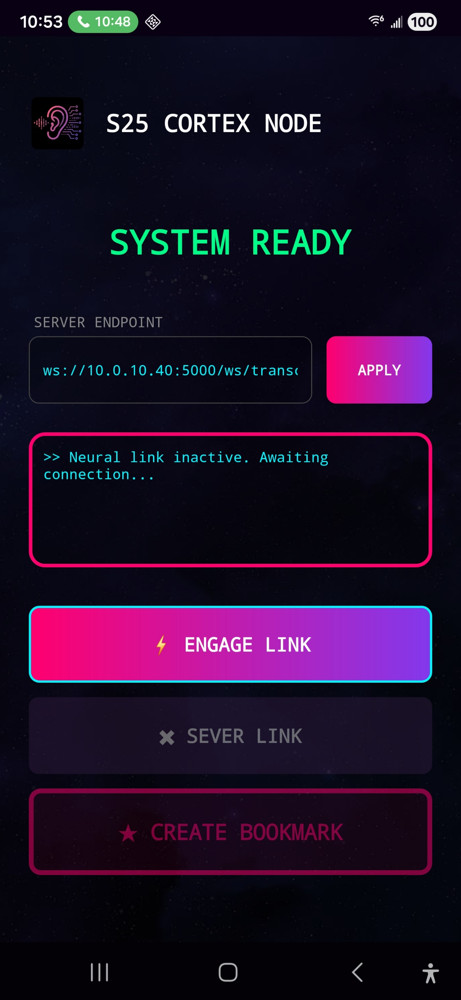
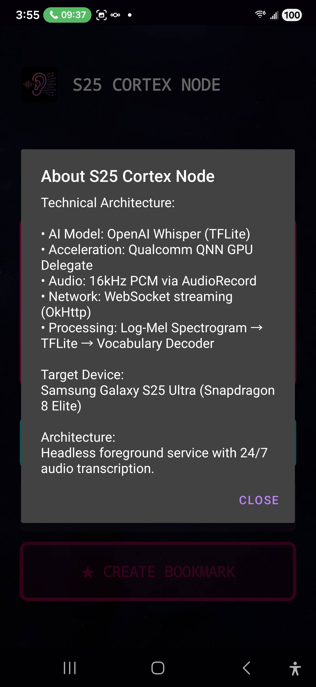

# Cortex Node

**Cortex Node** implementation for the **Samsung Galaxy S25 Ultra**.
This app is still very much pre-alpha and is dependentant on other projects like cortex-echo-chamber and more to come. Integration with n8n for agent work flow and OpenwebUI for RAG for the automation of technical documentation creation and being able to chat with that documentation later.



## Overview
This project is a high-performance, **headless AI transcription agent** designed specifically for the Samsung S25 Ultra (Snapdragon 8 Elite). It operates as a foreground service to capture audio, process it via a quantized Whisper TFLite model on the NPU/GPU, and stream the transcription data via WebSockets.

## Key Features
*   **Headless Architecture:** Runs as a foreground service with persistent notification; no active UI flow required.
*   **Edge AI:** Local inference using OpenAI's Whisper (Small/Medium) quantized for TFLite.
*   **Hardware Acceleration:** Optimized for Snapdragon 8 Elite using NNAPI/GPU Delegates.
*   **Real-time Streaming:** WebSocket client transmits JSON packets to a central server.
*   **Audio Pipeline:** Custom FFT and MelSpectrogram implementation for precise audio feature extraction.

## Tech Stack
*   **Language:** Kotlin (Coroutines for async)
*   **Minimum SDK:** Android 15 (API 35)
*   **Target SDK:** Android 16 (API 36)
*   **ML Engine:** TensorFlow Lite (`org.tensorflow:tensorflow-lite-gpu`)
*   **Networking:** OkHttp

## Project Structure
*   `MainActivity.kt`: Entry point and configuration UI.
*   `TranscriptionService.kt`: Core foreground service that manages the lifecycle.
*   `AudioEngine.kt`: Handles TFLite inference and audio buffer management.
*   `NetworkClient.kt`: Manages WebSocket connections and data streaming.
*   `MelSpectrogram.kt` & `FFT.kt`: Raw audio processing and feature extraction.
*   `VocabularyDecoder.kt`: Decodes TFLite model output into readable text.

## Setup & Build
**Prerequisites:**
*   Android Studio Ladybug (or newer)
*   JDK 17
*   Samsung S25 Ultra (recommended for NPU support)

**Build Commands:**
```bash
# Build Debug APK
./gradlew assembleDebug

# Run Unit Tests
./gradlew test
```

## Gallery
<div align="center">
  
  
</div>
